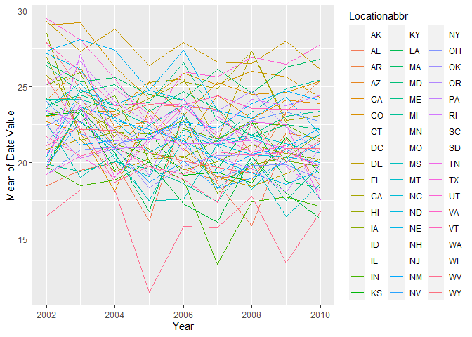
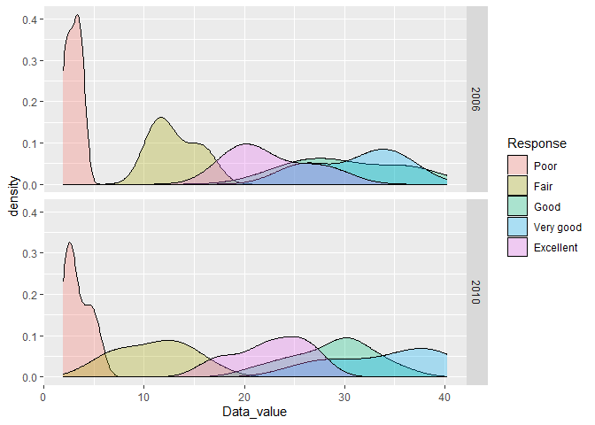
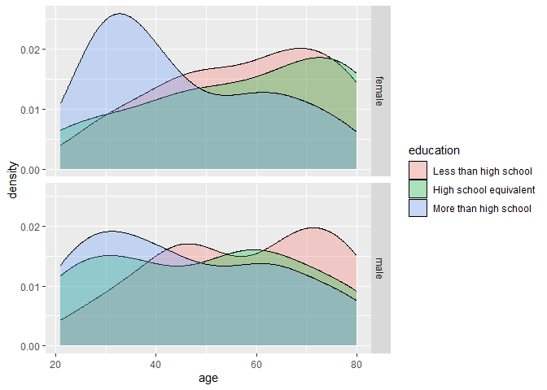
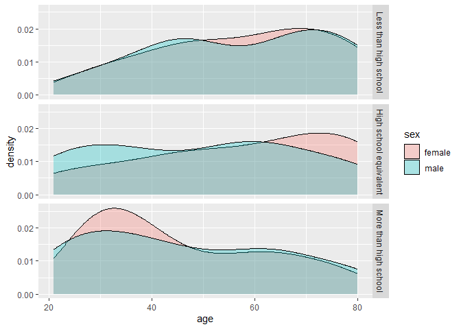
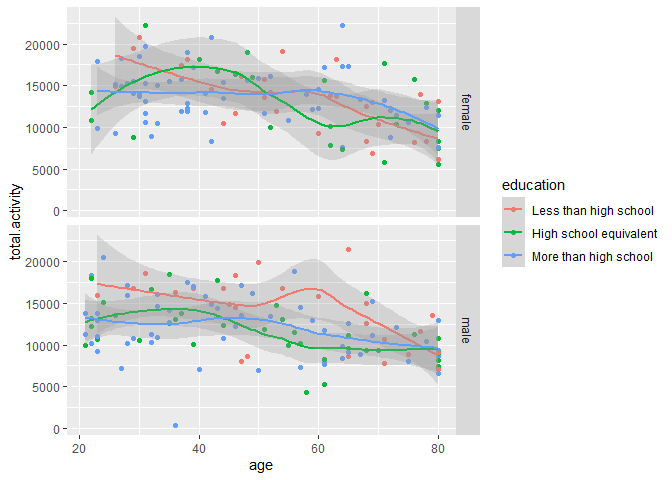
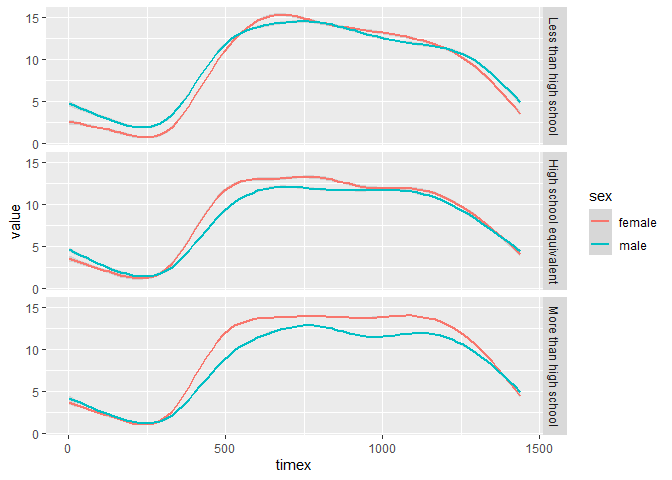

Problem 2

``` r
library(dplyr)
library(ggplot2)

#install.packages("devtools")
#devtools::install_github("p8105/p8105.datasets")

library(p8105.datasets)
data("brfss_smart2010")
```

``` r
#First, do some data cleaning: format the data to use appropriate variable names;
#focus on the “Overall Health” topic
#include only responses from “Excellent” to “Poor”
#organize responses as a factor taking levels ordered from “Poor” to “Excellent”
#Using this dataset, do or answer the following (commenting on the results of each):
names(brfss_smart2010)
```

    ##  [1] "Year"                       "Locationabbr"               "Locationdesc"               "Class"                      "Topic"                     
    ##  [6] "Question"                   "Response"                   "Sample_Size"                "Data_value"                 "Confidence_limit_Low"      
    ## [11] "Confidence_limit_High"      "Display_order"              "Data_value_unit"            "Data_value_type"            "Data_Value_Footnote_Symbol"
    ## [16] "Data_Value_Footnote"        "DataSource"                 "ClassId"                    "TopicId"                    "LocationID"                
    ## [21] "QuestionID"                 "RESPID"                     "GeoLocation"

``` r
brfss_smart2010.x <- brfss_smart2010 %>% 
                       filter(Topic == "Overall Health") %>% 
                       mutate(Response = factor(Response, levels = c("Poor", "Fair", "Good", "Very good", "Excellent")))


table(brfss_smart2010.x$Response)
```

    ## 
    ##      Poor      Fair      Good Very good Excellent 
    ##      2125      2125      2125      2125      2125

``` r
str(brfss_smart2010.x$Response)
```

    ##  Factor w/ 5 levels "Poor","Fair",..: 5 4 3 2 1 5 4 3 2 1 ...

``` r
#In 2002, which states were observed at 7 or more locations? What about in 2010? Construct a dataset that is limited to Excellent responses, and contains, year, state, and a variable that averages the data_value across locations within a state. Make a “spaghetti” plot of this average value over time within a state (that is, make a plot showing a line for each state across years – the geom_line geometry and group aesthetic will help).

 brfss_smart2010.x %>% 
  filter(Year == 2002) %>%
  group_by(Locationabbr) %>%
  summarise(x = n()) %>%
  filter(x >= 7)
```

    ## # A tibble: 36 × 2
    ##    Locationabbr     x
    ##    <chr>        <int>
    ##  1 AZ              10
    ##  2 CO              20
    ##  3 CT              35
    ##  4 DE              15
    ##  5 FL              35
    ##  6 GA              15
    ##  7 HI              20
    ##  8 ID              10
    ##  9 IL              15
    ## 10 IN              10
    ## # ℹ 26 more rows

``` r
# object
# function

 brfss_smart2010.x %>% 
  filter(Year == 2010) %>%
  group_by(Locationabbr) %>%
  summarise(x = n()) %>%
  filter(x >= 7)
```

    ## # A tibble: 45 × 2
    ##    Locationabbr     x
    ##    <chr>        <int>
    ##  1 AL              15
    ##  2 AR              15
    ##  3 AZ              15
    ##  4 CA              60
    ##  5 CO              35
    ##  6 CT              25
    ##  7 DE              15
    ##  8 FL             205
    ##  9 GA              20
    ## 10 HI              20
    ## # ℹ 35 more rows

``` r
 brfss_smart2010.x1 <- brfss_smart2010.x %>%
                         filter(Response == "Excellent") %>%
                         select(Year, Locationabbr, Data_value) %>%
                         group_by(Year, Locationabbr) %>%
                         summarise(mean = mean(Data_value)) #rows # columns
 
 
 ggplot(brfss_smart2010.x1, aes(x = Year, y = mean, group = Locationabbr, 
                                color = Locationabbr)) +
   geom_line() +
   ylab("Mean of Data Value")
```



``` r
 #.Make a two-panel plot showing, for the years 2006, and 2010, distribution of data_value for responses (“Poor” to “Excellent”) among locations in NY State.

  brfss_smart2010.x2 <- brfss_smart2010.x %>% 
                         filter(Year %in% c(2006, 2010)) %>%
                         filter(Locationabbr == "NY")

  
  ggplot(brfss_smart2010.x2, aes(x=Data_value, fill = Response)) +   
       geom_density(alpha=.3) +
       facet_grid(Year ~ .) 
```



Problem 3 Accelerometers have become an appealing alternative to
self-report techniques for studying physical activity in observational
studies and clinical trials, largely because of their relative
objectivity. During observation periods, the devices can measure MIMS in
a short period; one-minute intervals are common. Because accelerometers
can be worn comfortably and unobtrusively, they produce around-the-clock
observations.

``` r
library(readr)
nhanes_accel <- read_csv("nhanes_accel.csv")
nhanes_covar <- read_csv("nhanes_covar.csv", skip = 4)
```

Load, tidy, merge, and otherwise organize the data sets. Your final
dataset should include all originally observed variables; exclude
participants less than 21 years of age, and those with missing
demographic data; and encode data with reasonable variable classes
(i.e. not numeric, and using factors with the ordering of tables and
plots in mind).

``` r
library(tidyverse)

data <- nhanes_covar %>% 
          left_join(nhanes_accel, by= "SEQN") %>%
          filter(age >= 21) %>%
          drop_na(sex, age, BMI, education) %>%
          mutate(sex = ifelse(sex == 1, "male", "female"),
                 education = case_when(education == 1 ~  "Less than high school",
                                       education == 2 ~  "High school equivalent",
                                       education == 3 ~  "More than high school" ),
                 education = factor(education, 
                                    levels = c("Less than high school", 
                                               "High school equivalent", 
                                               "More than high school"))) 

#1 = Less than high school
#2 = High school equivalent
#3 = More than high school
```

Produce a reader-friendly table for the number of men and women in each
education category, and create a visualization of the age distributions
for men and women in each education category. Comment on these items.

``` r
table(data$sex, data$education)
```

    ##         
    ##          Less than high school High school equivalent More than high school
    ##   female                    28                     23                    59
    ##   male                      27                     35                    56

``` r
  ggplot(data, aes(x =age, fill = education)) +   
       geom_density(alpha = .3) +
       facet_grid(sex ~ .) 
```



``` r
  ggplot(data, aes(x=age, fill = sex)) +   
       geom_density(alpha=.3) +
       facet_grid(education ~ .) 
```



Traditional analyses of accelerometer data focus on the total activity
over the day. Using your tidied dataset, aggregate across minutes to
create a total activity variable for each participant. Plot these total
activities (y-axis) against age (x-axis); your plot should compare men
to women and have separate panels for each education level. Include a
trend line or a smooth to illustrate differences. Comment on your plot.

``` r
data1 <- data %>%
         mutate(total.activity = rowSums(across(min1:min1440), na.rm = T))

#sum(c(1,2,3))
#sum(c(NA,39,23),na.rm = T)
#mean(c(NA,39,23),na.rm = T)

data2 <- data %>% 
  rowwise() %>% 
  mutate(sumrange = sum(across(min1:min1440), na.rm = T))

ggplot(data1, aes(x = age, y = total.activity, color = education)) +   
       geom_point() +
       geom_smooth(alpha = 0.3) +
       facet_grid(sex ~ .) 
```


Accelerometer data allows the inspection activity over the course of the
day. Make a three-panel plot that shows the 24-hour activity time
courses for each education level and use color to indicate sex. Describe
in words any patterns or conclusions you can make based on this graph;
including smooth trends may help identify differences.

``` r
#wide format -> Long format
data3 <- data  %>%
  pivot_longer(
    cols = starts_with("min"),
    names_to = "time",
    values_to = "value",
    values_drop_na = TRUE
  )
# regex 

data3$timex <- as.numeric(gsub("min", "", data3$time))
str(data3$timex)
```

    ##  num [1:328320] 1 2 3 4 5 6 7 8 9 10 ...

``` r
# gsub("min","","min993")
#pivot_wider()

ggplot(data3, aes(x= timex, y = value, color = sex)) +   
       geom_smooth(alpha =.3) +
       facet_grid(education ~ .)
```


